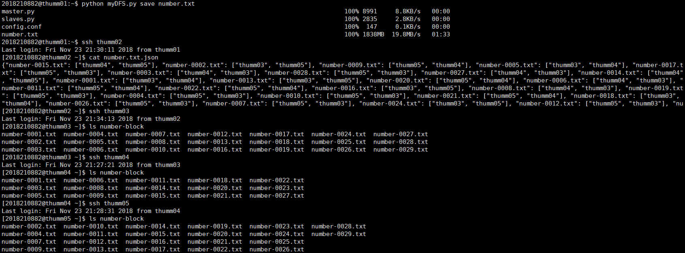
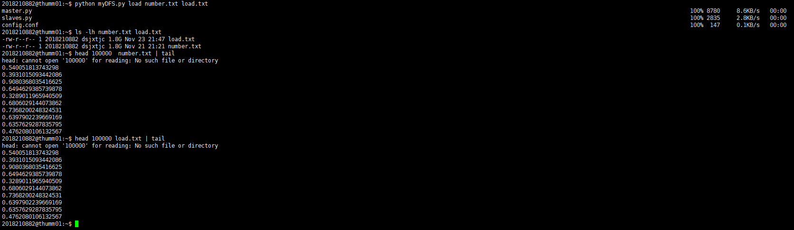

# SimpleDFS
A simple distributed file system (DFS)

&emsp;假设我们有``thumm01-thumm05``几台服务器，这里将``thumm01``作为客户端，将``thumm02``作为主机器``master``，将剩余的
``thumm03-thumm05``作为从机器``slave``（在配置文件中进行设置，所以可以根据需要修改``master``和``slave``为``thumm02-thumm05``中的任何机器），规定客户端只能和``master``进行通信，``master``充当了DFS和客户端的一个桥梁。主要实现了两个功能，上传文件和下载文件。上传文件的时候``master``充当的是接收文件、切分文件然后分发文件分块到各``slave``的功能；下载文件的时候``master``起的是从``slave``中取回分块、整合分块然后传送整合文件到客户端的功能。

### 文件切分

&emsp;文件切分依据的原则是“不超过设定分块大小，不断行”，也就是分块的时候是一行行地读源文件到分块文件，一旦发现如果读入当前行就会导致分块大小大于设定分块大小，就关闭分块，同时将当前行写到新的分块。

### 上传文件

&emsp;客户端上传文件到``master``，``master``根据配置文件设定的分块大小对文件进行切分，暂存于``master``上，完成切分之后删除原来的完整文件。对于每一个分块，``master``根据配置文件给出的``replication``因子，在同样由配置文件给出的多个``slave``中随机选择``replication``个``slave``作为存放此分块的机器，将分块发送到``slave``机器上，同时记录分块存放的信息。完成之后，将``master``上的各个分块文件删除，只保存它们的分块存放信息。

### 下载文件

&emsp;客户端向``master``请求下载文件，``master``根据文件名，在本机上找到对应的分块存放信息，在找到的存放分块的多个``slave``中随机选择一个，然后命令此``slave``向``master``发送分块文件，所有分块文件都发送完毕之后，``master``根据所有分块的文件名进行排序，然后按照顺序将所有分块文件逐一写入一个新文件以整合成一个大文件，并发送回客户端，发送完成之后删除在``mater``上的整合文件以及各个分块文件。

### 文件传输

&emsp;同时，各``slave``之间有一个向其他``slave``请求文件传输的功能。当一个``slave``需要某个分块，可以向``master``请求拥有此分块的``slave``地址，``master``根据分块文件名在本机找到存有此分块文件的随机一个``slave``，得到返回的``slave``地址后向其请求文件的传输，同时应该在``master``的记录表中将
当前``slave``增加到此分块的``slave``信息中去。

### 示例

上传文件：

    
     
    

下载文件：

    
     
    

